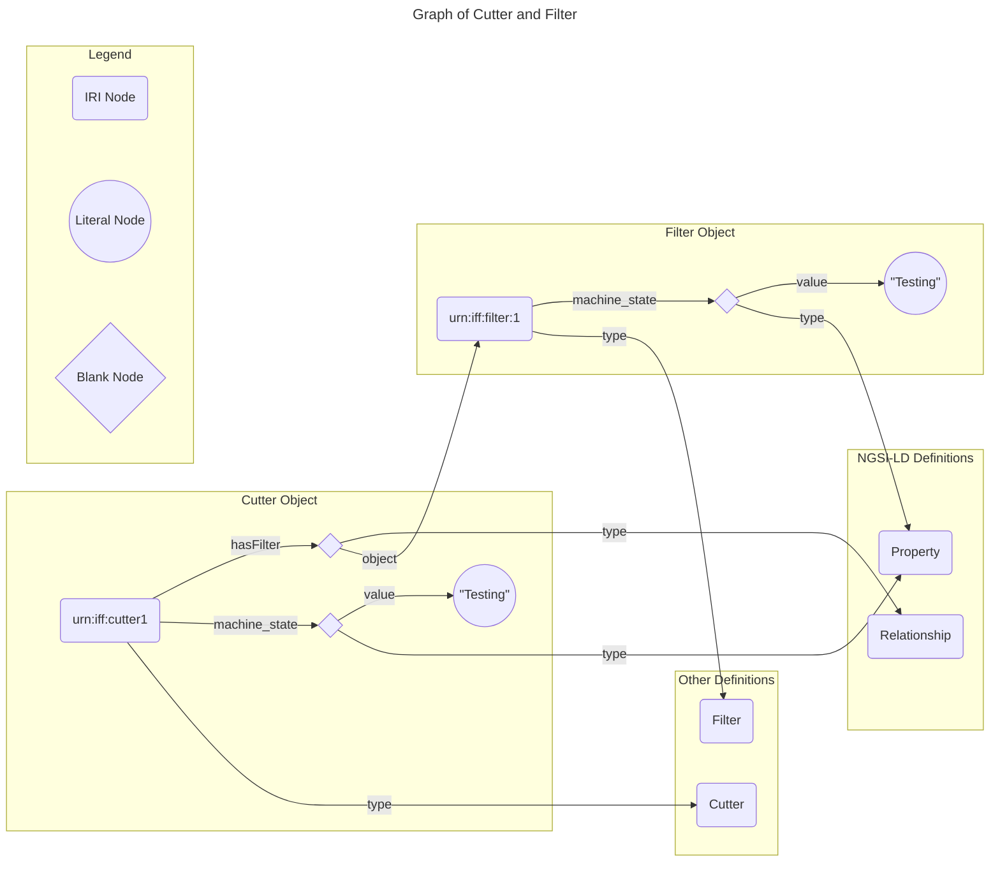

# Semantic Datamodel Tutorial

## Motivation
A fundamental difference between JSON-LD and JSON is, that JSON describe generic objects and JSON-LD graphs of relationships. A consequence of this is that two JSON-LD object are identical interpreted, if they represent the same graph. For instance, the following object

```json
[
    {
        "@context": [
            "https://uri.etsi.org/ngsi-ld/v1/ngsi-ld-core-context.jsonld",
            {
                "@vocab": "https://industry-fusion.org/base/v0.1/"
            }
        ],
        "id": "urn:iff:cutter1",
        "type": "Cutter",
        "hasFilter": {
            "type": "Relationship",
            "object": "urn:iff:filter1"
        },
        "machine_state": {
            "type": "Property",
            "value": "Testing"
        }
    },
    {
        "@context": [
            "https://uri.etsi.org/ngsi-ld/v1/ngsi-ld-core-context.jsonld",
            {
                "@vocab": "https://industry-fusion.org/base/v0.1/"
            }
        ],
        "id": "urn:iff:filter1",
        "type": "Filter",
        "machine_state": {
            "type": "Property",
            "value": "Testing"
        }
    }
]
```
represents the following graph:



The same graph can, however, be represented by different JSON-LD structures. For instance, this representation is equivalent to the graph above:

```json
[
    {
        "@context": [
            "https://uri.etsi.org/ngsi-ld/v1/ngsi-ld-core-context.jsonld",
            {
                "@vocab": "https://industry-fusion.org/base/v0.1/"
            }
        ],
        "id": "urn:iff:cutter1",
        "type": "Cutter",
        "hasFilter": {
            "type": "Relationship",
            "object": {
                "id": "urn:iff:filter1",
                "type": "Filter",
                "machine_state": {
                    "type": "Property",
                    "value": "Testing"
                }
            }
        },
        "machine_state": {
            "type": "Property",
            "value": "Testing"
        }
    }
]
```

The problem is that there are even more representations of the same graph. Therefore, it is challenging, to use a JSON-Schema which is focussing on the *syntactic* structures of an object and not so much on the linked representation. Moreover, it would be very complex, if not impossible, to create a compliant JSON-Schema which validates all potential representations of the graph above. This shows that linked data cannot be handled with classical JSON-tools. On the other hand, most developers in the IT world are used to handle their data with JSON and JSON-Schema. Therefore, a bridge is needed between the two technologies. It is clear that JSON-Schema cannot validate links between objects. But all non-linked data must be validatable with JSON-Schemas. The approach to reach that goal contains three steps:
1. Simplify the problem: Handle with JSON-Schema only single objects, e.g. only a *Cutter* or *Filter* object.
2. Transform the JSON-LD object into a canonical normal form which ensures that same (sub-)graphs are represented by identical objects.
3. Generate the SHACL constraints from JSON-Schemas
4. Validate single objects with JSON-Schema and linked objects with SHACL

Step 1. can be achieved straight forward. The other step need additional considerations.

## NGSI-LD: Transform JSON-LD Objects into a Canonical Normal Form

### RDF (Resource Description Framework)

The Resource Description Framework, commonly known as RDF, is a key technology underpinning the concept of linked data. Developed by the World Wide Web Consortium (W3C), RDF serves as a foundation for representing and linking diverse data on the web in a machine-readable format.
Key Concepts of RDF:

    Triple Structure: RDF represents information in triples, each consisting of a subject, predicate, and object. This structure forms the basis for creating statements about resources.

    Resource Identification: Resources are identified using Uniform Resource Identifiers (URIs), providing a globally unique and standardized way to reference entities on the web.

    Graph-Based Model: RDF employs a graph-based data model, enabling the creation of interconnected networks of information. This facilitates the creation of relationships between different pieces of data.

    Ontologies and Vocabularies: RDF can be enhanced with ontologies and vocabularies, such as RDF Schema (RDFS) and the Web Ontology Language (OWL), to provide a shared understanding of the meaning of terms and relationships.

A good introduction to RDF is given [here](https://cambridgesemantics.com/blog/semantic-university/learn-rdf/).


### JSON-LD

JSON-LD (JavaScript Object Notation for Linked Data) is closely related to RDF (Resource Description Framework) as it serves as a serialization format for expressing RDF data in JSON. Developed by the World Wide Web Consortium (W3C), JSON-LD is specifically designed to bring the principles of linked data to the world of JSON.

In JSON-LD, data is structured in a way that aligns with RDF's triple model, with subjects, predicates, and objects represented as JSON objects and values. The key feature of JSON-LD is its ability to seamlessly interoperate with RDF data by providing a simple and readable syntax while maintaining compatibility with the RDF data model.

By incorporating JSON-LD, developers can bridge the gap between JSON-based data modelling and the Semantic Web, fostering interoperability and enabling a wider range of applications to participate in the linked data ecosystem. JSON-LD facilitates the creation of documents that are both human-readable and machine-understandable, promoting the broader adoption of linked data principles in diverse environments such as manufacturing.

#### Setup Tutorial
To prepare the tutorial setup, execute the following command in the `datamodel/tools` directory:

```
make setup
```

After the setup, 5 tools must be available:
1. rdfpipe
2. pyshacl
3. validate.js
3. jsonldConverter.js
5. jsonschema2shacl.js


#### The @context
First exercise is to transform JSON-LD into RDF/turtle data:

```json
# JSON-LD Data:
{
    "@context": "https://industryfusion.github.io/contexts/v0.1/context.jsonld",
    "id": "urn:iff:abc123",
    "type": "eclass:0173-1#01-AKJ975#017"
}

```
```
# Transform:
rdfpipe  -i json-ld -o ttl ../examples/simple_plasmacutter_data.json
```
```
# Result:
<urn:iff:abc123> a <https://industry-fusion.org/eclass#0173-1#01-AKJ975#017> .
```

The result is showing a single triple line. `a` is an abbreviation for `rdf:type`. I.e. the triple defines an object with `id` equal to `<urn:iff:abc123>` and type equal to `https://industry-fusion.org/eclass#0173-1#01-AKJ975#017`. But why was `eclass:0173-1#01-AKJ975#017` translated to `https://industry-fusion.org/eclass#0173-1#01-AKJ975#017`? To answer the question, we take a closer look to the `@context` field. When we resolve the url `https://industryfusion.github.io/contexts/v0.1/context.jsonld`, we get the following result:

```
wget -O - https://industryfusion.github.io/contexts/v0.1/context.jsonld 2> /dev/null
```
```json
# Result:
{ 
        "@context": [
                "https://uri.etsi.org/ngsi-ld/v1/ngsi-ld-core-context.jsonld",
                {
                    "@vocab": "https://industry-fusion.org/base/v0.1/",
                    "eclass": {
                        "@id": "https://industry-fusion.org/eclass#",
                        "@prefix": true
                    },
                    "xsd": {
                        "@id": "http://www.w3.org/2001/XMLSchema#",
                        "@prefix": true
                    },
                    "iffb": {
                        "@id": "https://industry-fusion.org/base/v0.1/",
                        "@prefix": true
                    },
                    "iffk": {
                        "@id": "https://industry-fusion.org/knowledge/v0.1/",
                        "@prefix": true
                    },
                    "rdf": {
                        "@id": "http://www.w3.org/1999/02/22-rdf-syntax-ns#",
                        "@prefix": true
                    },
                    "rdfs": {
                        "@id": "http://www.w3.org/2000/01/rdf-schema#",
                        "@prefix": true
                    },
                    "schema": {
                        "@id": "http://schema.org/",
                        "@prefix": true
                    },
                    "sh": {
                        "@id": "http://www.w3.org/ns/shacl#",
                        "@prefix": true
                    }
                }
        ]
}

```
One part seems to be related:

```json
"eclass": {
    "@id": "https://industry-fusion.org/eclass#",
    "@prefix": true
}
```
This is defining to replace in all IRI's, types and key in the JSON-LD object "eclass:" by `"https://industry-fusion.org/eclass#"`. This is in general the role of the @context. It defines namespaces like `eclass:` and types of fields in the JSON-LD object.

#### Expanded form
To get rid of the @context, everything in the JSON-LD object has to be transformed into an explicit state, so that no @context is needed.

In the following execise the JSON-LD object is expanded:

```
node ./jsonldConverter.js -x ../examples/simple_plasmacutter_data.json
```
```
# Result:
[
  {
    "@id": "urn:iff:abc123",
    "@type": [
      "https://industry-fusion.org/eclass#0173-1#01-AKJ975#017"
    ]
  }
]
```

You can see that as a result, the @context field is missing and the `eclass:` prefix has been expanded. Also, the fields `id` and `type` are resolved to `@id` and `@type`. This is defined in the NGSI-LD context `https://uri.etsi.org/ngsi-ld/v1/ngsi-ld-core-context.jsonld` which is part of the @context definition as well. We call this transformation an *expansion*.

#### Compacted Form

The inverse operation of *expansion* is a *compaction*. One problem of the *compaction* is, that the *expanded Form* does no longer contain a @context. So the @context has to be added back explicitly. With a fixed @context, the *compaction* is uniquely defined, i.e. there is no other *compacted form*, given an *expanded form* and a @context.
```
node ./jsonldConverter.js -n ../examples/simple_plasmacutter_data_expanded.json -c https://industryfusion.github.io/contexts/v0.1/context.jsonld
```
```
# Result
[
  {
    "@context": "https://industryfusion.github.io/contexts/v0.1/context.jsonld",
    "id": "urn:iff:abc123",
    "type": "eclass:0173-1#01-AKJ975#017"
  }
]
```

### NGSI-LD

## Generate SHACL constraints from JSON-Schemas

### JSON-Schema

### SHACL Constraints

### Conversion

## Validate objects

### Validate Single Objects with JSON-schema and SHACL
### VAlidate connected Object with SHACL

```

```