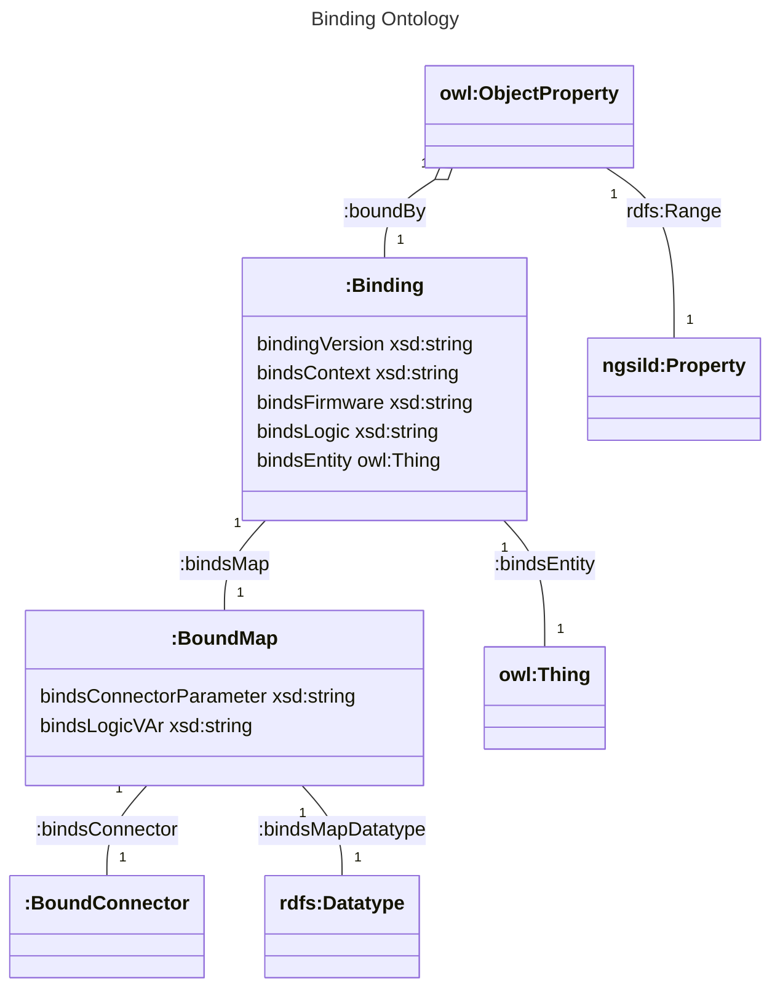

# Dataservice setup
Dataservice grabs data from different source and maps them into the data-model. The simplest setup is a 1:1 mapping which receives one value per NGSI-LD model parameter and forwards it directly. Advanced usecase is to get data from different sources and map it to a common model. A formal binding between the datamodel and the data sources is done and can be configured for different machine setup.
## Setup and Activate Device
For this service to work, a multi-entity device activation is needed. That means that a device does not consist any longer of only one entity ID. A hierarchy of subcomponents with different device IDs can be supported.

## Binding Semantics

The terms needed for binding are described in https://industryfusion.github.io/contexts/staging/ontology/v0.1/binding.ttl.




### Classes
```
:Binding
    A binding contains all informations to calculate the value of a model attribute. For instance, to calculate ex:state you need to know where to get the metrics from (e.g. from a machine and an ontology) and how to calculate it e.g. take a numeric value from the machine and use the ontology to create an IRI.
Example:
    ex:myBinding a :Binding .
    ex:myBinding :bindsEntityType ex:cutter .
    ex:myBinding :bindsMap ex:map1 .
    ex:myBinding :bindsMap ex:map2 .
    ex:myBinding :bindingVersion "0.1"
    ex:myBinding :bindsFirmware "myFirmware"
    ex:myBinding:bindsLogic "WHERE { BIND(?var1) as ?value}"

:BoundMap
    A Bound Map contains a single map to define mapping from metrics to a model parameter. Several maps can be used to provide metrics for model properties. For instance it provides the rules to calculate the property ex:state with two maps:
Example:
    ex:map1 a :BoundMap .
    ex:map2 a :BoundMap .
    ex:map1 :bindsConnector :TestConnector .
    ex:map1 :bindsMapsDataType xsd:float .
    ex:map1 :bindsLogicVar "var1" .
    ex:map1 :bindsConnectorParameter 'mytestparam' .
    ex:map2 :bindsConnector :OPCUAConnector .
    ex:map2 :bindsMapsDataType xsd:boolean .
    ex:map2 :bindsLogicVar "var1" .
    ex:map2 :bindsConnectorParameter 'ns=3;i=5002' .
```
### Properties
```
:bindsLogic
    DataProperty: :bindsLogic
    Domain: 
        :Binding
    Range: 
        xsd:string
    Contains the "WHERE" part of a SPARQL expression. It is expected to deliver a ?value variable. The value can be build from BoundMap variables. If there is no bindslogic value and there is only one single BoundMap, the value is taken directly without SPARQL expression.

```


## Use Dataservice to send testdata
Start dataservice with `startDataservice.py`:
    python3 ./startDataservice.py \<ontology-dir\> \<type\> \<binding-name\>

*\<ontology\>* is supposed to be downloadable from a directory containing different *.ttl files, *\<type\>* is the (in the ontology context) namespaced class (e.g. `ex:MyClass` if `ex:` is defined in the ontologies context) and *\<binding-name\>* is the name of a *.ttl file in the *bindings* subdirectory of the ontoloy.

Example:

    python3 ./startDataservice.py  https://industryfusion.github.io/contexts/example/v0.1  iffBaseEntity:Cutter  base_test.ttl
